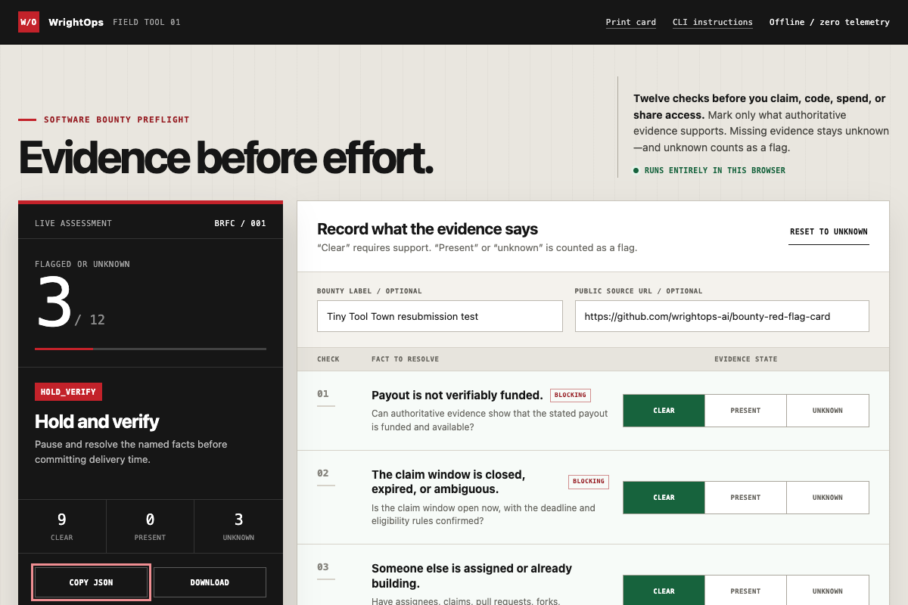

# Bounty Red-Flag Card

An executable, offline preflight for software bounties: twelve checks to run
before you claim work, write code, pay a bond, buy equipment, or share access.

The browser app, CLI, Markdown card, and print card are free and intentionally
skeptical. Unknown facts count as flags until authoritative evidence resolves
them.



## Run the free tool

- [Launch the interactive browser app](https://wrightops-ai.github.io/bounty-red-flag-card/)
- [Open the self-contained app source](bounty-red-flag-card/index.html)
- [Run the zero-dependency CLI](bounty-red-flag-card/README.md#run-the-cli)
- [Open the Markdown card](bounty-red-flag-card/BOUNTY-RED-FLAG-CARD.md)
- [Open the print-ready HTML card](bounty-red-flag-card/BOUNTY-RED-FLAG-CARD.html)
- [Download the latest release](https://github.com/wrightops-ai/bounty-red-flag-card/releases/latest)
- [Verify release checksums](bounty-red-flag-card/dist/SHA256SUMS)

The interactive app is a self-contained file with inline logic and no runtime
network requests. The separate print HTML remains script-free. Neither tool
loads fonts, images, analytics, or external resources.

No input is uploaded, stored, or transmitted. The CLI requires Node.js 20 or
newer but no package installation.

## What it checks

The preflight covers funding, availability, competition, acceptance criteria,
payment authority, upfront costs, access requests, third-party dependencies,
hidden scope, project health, rights and compliance, and expected hourly return.

The result is triage—not proof that a bounty is safe, legal, compliant,
profitable, eligible, acceptable, or payable.

## Want an evidence-backed decision?

WrightOps offers a **Bounty GO/NO-GO Review for $49** after written scope
confirmation.

For one public software bounty or listing, the review delivers:

- an evidence-pinned funding and claimability check;
- competition, authority, acceptance, access, and rights findings;
- a bounded scope and expected-return estimate;
- a clear `GO`, `HOLD`, or `NO-GO` recommendation with unresolved facts named.

[Open the public GitHub request form (sign-in required)](https://github.com/wrightops-ai/bounty-red-flag-card/issues/new?template=bounty-review.yml),
inspect the [sample GO/HOLD/NO-GO report](docs/sample-bounty-go-no-go-review.md),
or read the [complete service and refund terms](docs/bounty-go-no-go-review.md).

Do not pay before WrightOps confirms the public target, deliverable, timing, and
fit in writing. Never put credentials, private code, customer data, email
addresses, wallet secrets, or payment information in a GitHub issue.

## Validate

Requires Node.js 20 or newer.

```sh
npm test
npm run validate
npm run build
```

The release builder fixes timestamps, permissions, archive ownership metadata,
and file order so independently repeated builds are byte-identical.

## Rights and boundaries

The card is MIT licensed. You may copy, adapt, redistribute, or sell it when
the copyright and permission notice are preserved. No purchase transfers
exclusive rights.

The card and paid review are not legal, tax, financial, security, privacy, or
compliance advice. They do not claim a bounty, contact a payer, execute
repository code, sign a wallet transaction, spend funds, or guarantee payment.

WrightOps is an owner-authorized operating brand. Zachary Wright is the
accountable human owner for paid scope, delivery, payment, and refunds.
